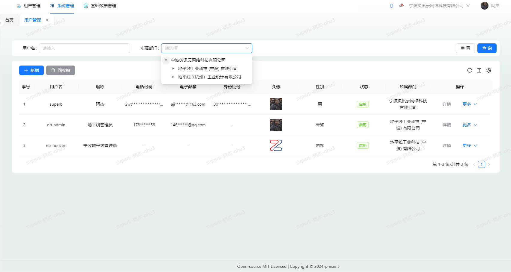

Superb-Solon 高质量[Solon](https://solon.noear.org/)开发框架
===============
（发布日期：2024-08-2）

项目介绍
-----------------------------------

<h3 align="center">Superb</h3>

Superb 是一款基于Java17+Solon开发的技术框架！前后端分离架构 Solon2.8.x，SolonCloud，Ant Design Pro&React，Mybatis-Flex，Sa-Token，支持微服务。既能快速提高代码运行效率，节省研发成本和硬件成本，同时又不失灵活性！

**Java “纯血国产”应用开发框架。从零开始构建，有自主的标准规范与开放生态。目前已近14万行代码。**

- 追求： **更快、更小、更简单**
- 提倡： **克制、简洁、高效、开放、生态**

### 特色：

| 特性                 | 描述                                                         |
| -------------------- | ------------------------------------------------------------ |
| 更高的计算性价比     | 并发高 2～ 3 倍；内存省 50%                                  |
| 更快的开发效率       | 内核小，入门快；调试重启可快至 10 倍                         |
| 更好的生产与部署体验 | 打包最多缩小 90%                                             |
| 更大的兼容范围       | 非 java-ee 架构；同时支持 java8 ～ java22，graalvm native image |

### 更快、更小、更简单

#### 1、所谓更快：

- 并发高 2 ～ 3 倍。
- 启动快 5 ～ 10 倍。

| solon 1.12.2                              | 大小 | QPS        |
| ----------------------------------------- | ---- | ---------- |
| solon.boot.jdkhttp(bio)                   | 0.2m | 6.4万左右  |
| solon.boot.jlhttp(bio)                    | 0.3m | 13.2万左右 |
| solon.boot.jetty(nio, 支持servlet api)    | 2.2m | 12.3万左右 |
| solon.boot.undertow(nio, 支持servlet api) | 4.5m | 12.0万左右 |
| solon.boot.smarthttp(aio) [国产]          | 0.7m | 16.6万左右 |

| spring boot 2.3.3            | 大小  | QPS       |
| ---------------------------- | ----- | --------- |
| spring-boot-starter-tomcat   | 16.1m | 3.2万左右 |
| spring-boot-starter-jetty    | 16m   | 3.7万左右 |
| spring-boot-starter-undertow | 16.8m | 4.4万左右 |

#### 2、所谓更小：

- 打包小 50% ~ 90%
- 内存省 50%
- 最小 Web 完整开发单位 1Mb（相比 Springboot 项目包，小到可以乎略不计了）

#### 3、所谓更简单：

- 代码操控：除了注解模式之外，还可以按需手动（不用绕，更直接）。

#### 项目说明

| 项目名              | 说明                                   |
| ------------------- | -------------------------------------- |
| `superb-common`     | Superb工具包                           |
| `superb-admin`      | Superb前端Antd Pro+React               |
| `superb-allocation` | Superb公共服务，包含数据字典和区域治理 |
| `superb-system`     | Superb系统模块                         |
| `superb-gateway`    | Superb公共网关入口                     |


后台目录结构
-----------------------------------
```
项目结构
├─superb-solon（父POM： 项目依赖、modules组织）
│  ├─superb-common  工具包
│  │  ├─superb-common-bom    公共版本定义
│  │  ├─superb-common-core   核心包，公共枚举、异常统一返回、Nacos实例和配置监控
│  │  ├─superb-common-database   数据库包，支持多数据源、MyBatis-Flex、租户拦截、数据权限、字段填充、索引检查插件待测试
│  │  ├─superb-common-doc   knife4j文档配置包，配置都在nacos配置文件中读取
│  │  ├─superb-common-redis   缓存工具包，缓存集成redisson，支持分布式锁，注解锁
│  │  ├─superb-common-security   安全模块，集成了Sa-Token国产安全框架，支持Sa-Token注解
│  │  ├─superb-common-utils   工具类，字符串工具类、ip、url、header、加密等工具类
│  ├─superb-gateway           --微服务网关模块(9999)，支持负载均衡
│  ├─superb-system            --微服务系统管理
│  │  ├─superb-system-api            微服务系统接口对外引用包
│  │  ├─superb-system-biz            微服务系统实现(4000)
│  ├─superb-allocation        --微服务通用管理模块
│  │  ├─superb-allocation-api            微服务对外引用包
│  │  ├─superb-allocation-biz            微服务公共服务实现(4010)
```


实现功能
-----------------------------------
* 采用最新主流前后分离微服务框架
* 封装完善的用户、角色、菜单、组织机构、数据字典、在线用户等基础功能，支持按钮权限、数据权限等功能
* 采用前后分离技术，页面UI风格精美，针对常用组件做了封装：区域选择器、按钮重写、数据权限选择、回收站、部门树、部门数下拉选择、高级上传等
* 数据权限（精细化数据权限控制，控制到行级，列表级，实现不同人看不同数据
* 页面校验自动生成(必须输入、数字校验、金额校验、时间空间等);
* 分布式文件服务，Solon-Cloud已集成，我们无需过度封装
* 多数据源：及其简易的使用方式，在线配置数据源配置，便捷的从其他数据抓取数据；
* 专业接口对接机制，统一采用restful接口方式，集成knife4j在线接口文档
* 提供简单易用的打印插件，支持谷歌、火狐、IE11+ 等各种浏览器
* 采用maven分模块开发方式
* 支持菜单动态路由
* 权限控制采用 RBAC（Role-Based Access Control，基于系统角色+部门角色的访问控制）
* 支持版本灰度和ip灰度
* 负载均衡支持策略 随机、ip哈希、轮训、权重
* 分布式锁实现、注解锁实现


技术架构：
-----------------------------------
#### 开发环境

- 语言：Java 17+

- IDE(JAVA)： IDEA2022.2+

- IDE(前端)： Vscode、WebStorm、IDEA

- 依赖管理：Maven

- 缓存：Redis

- 数据库脚本：MySQL5.7+


#### 后端

- 基础框架：Solon 2.8.6

- 微服务框架： Solon Cloud + Solon Gateway + Nacos2

- 持久层框架：MybatisFlex 1.9.4

- 安全框架：Sa-Token 1.38

- 微服务技术栈：Solon Cloud、Nacos、Gateway、Sentinel

- 数据库连接池：HikariCP

- 日志打印：logback(lombok)


## 微服务解决方案


1、服务注册和发现 Nacos √

2、统一配置中心 Nacos  √

3、路由网关 gateway(三种加载方式) √

4、分布式 http feign √

5、熔断降级限流 Sentinel、令牌桶限流guava √

6、分布式文件 均支持 √

7、统一权限控制 Sa-Token √

8、服务监控 SolonAdmin

9、链路跟踪

10、消息中间件

11、分布式任务

12、分布式事务

13、分布式日志  √

14、暂未支持 docker-compose、k8s、jenkins

### 功能模块
```
├─系统管理
│  ├─用户管理（数据权限-支持本人、全部、本部门、本部门及子部门、子部门、自定义）
│  ├─角色管理（权限分配）
│  ├─菜单管理（侧边栏菜单、顶部菜单、中台菜单、其他菜单[由数据字典定义]、权限设置）
│  ├─部门管理
│  ├─租户系统配置（支持修改水印是否显示、登录页登录方式、登录页背景图片、登录页背景视频等）
│  └─多租户管理
├─基础数据管理
│  ├─数据字典（普通字典、树形字典）
│  ├─行政区划管理
│─封装通用组件	
│  ├─区域树下拉异步选择组件
│  ├─按钮主题定制组件
│  ├─数据权限切换组件
│  ├─回收站组件
│  ├─部门树组件
│  ├─部门下拉选择组件
│  └─高级表单文件上传组件
└─其他模块
   └─更多功能开发中。。
   
```

## 项目效果演示

登录页面登录背景图片或背景可配置


主页面


租户管理，可对租户信息进行初始化同步


炙讯云->为旗下租户(地平线公司)进行初始化，可初始化菜单、权限、系统角色、管理员


角色管理-各个租户自己管理、可支持部门角色


权限分配：粒度为方法接口、按钮显隐


用户管理，自带数据权限过滤、与租户信息都支持了数据脱敏(字段加密在本框架中未使用，在Superb Cloud Spring中已实现数据字段加密)



菜单管理-各个租户自定义


权限管理


部门管理


租户系统配置：暂未开始


数据字典类型定义


数据字典配置项


行政区划管理，目前基础数据精确到街道、乡、镇


数据权限的切换，可以一个账号测试多种不同角色权限，和数据权限，可以灵活切换


个人信息和主题定制


个人信息支持账号修改、密码修改、头像等基础信息修改


主题可以定制，不同风格，主题跟随账号保存

